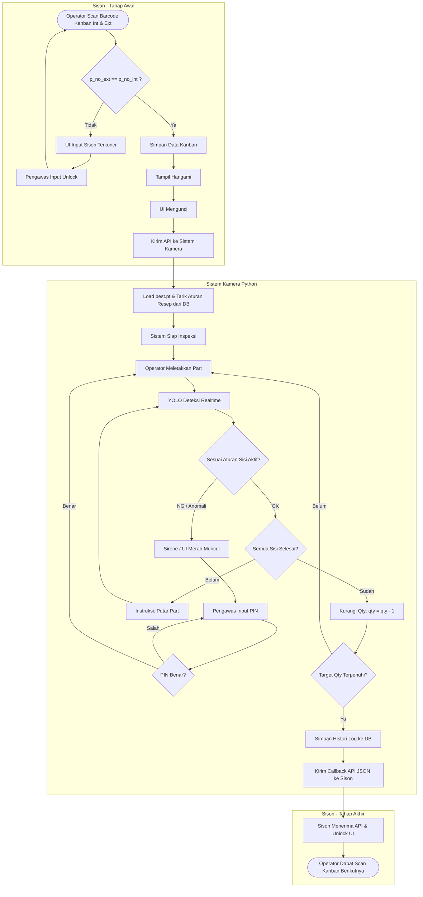

# Workflow Aplikasi: Sison & Sistem Kamera

Berikut adalah alur sistem (Sison & Sistem Kamera) berdasarkan spesifikasi yang diberikan. 

## Spesifikasi Data API
### 1. Sison -> Kamera
- **Format**: JSON
- **Data**: `id_trans`, `lot`, `p_no`, `unique_no`, `p_name`, `qty`

### 2. Kamera -> Sison (Callback)
- **Format**: JSON
- **Data**: `id_trans`, `status`
- **Status Value**: `0` (GAGAL), `1` (SUKSES), `2` (PROSES)
