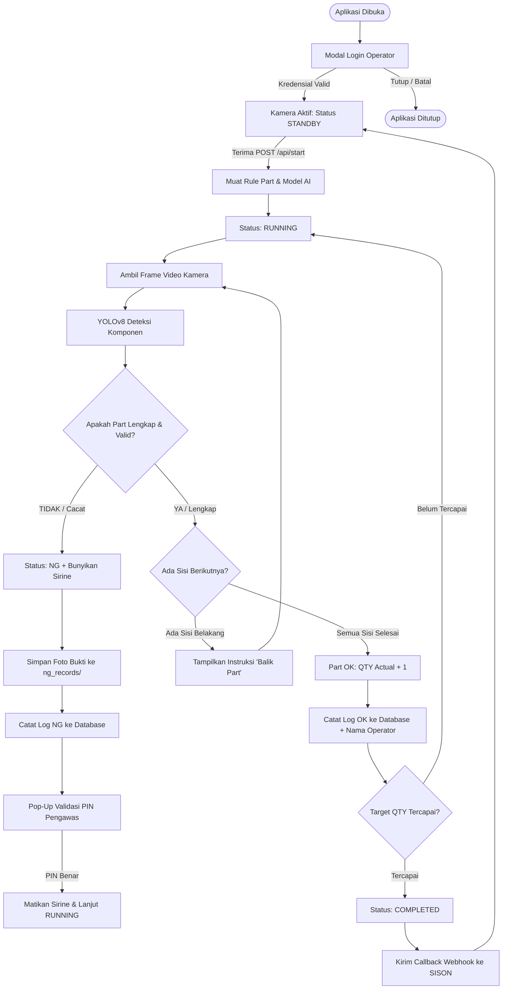
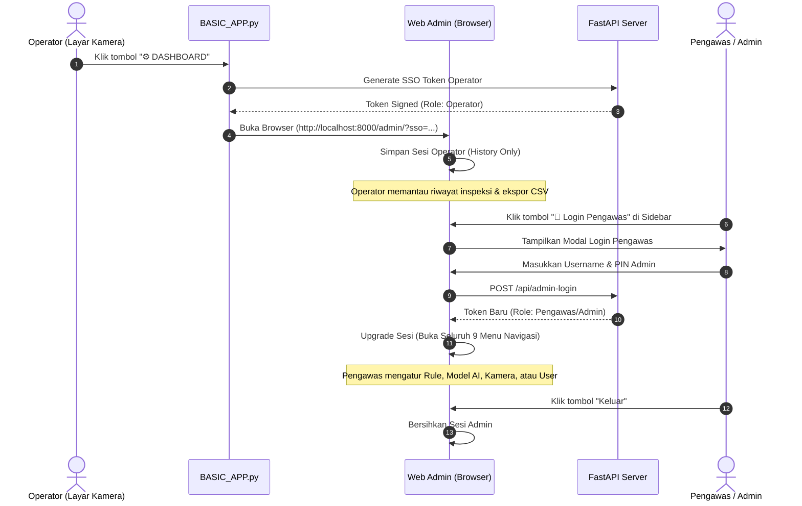

# 📘 WORKFLOW FINAL: SISTEM KAMERA INSPEKSI AI & QUALITY CONTROL

Dokumentasi resmi alur kerja (*end-to-end operational workflow*), arsitektur teknis, integrasi sistem SISON, pipeline Computer Vision YOLOv8, mekanisme *Supervisor Override*, serta manajemen ketahanan data (*offline resilience*).

---

## 📑 Daftar Isi
1. [Arsitektur Global Sistem](#1-arsitektur-global-sistem)
2. [Alur Kerja Lengkap (End-to-End Workflow)](#2-alur-kerja-lengkap-end-to-end-workflow)
   - [Fase 1: Booting & Login Operator (Desktop UI)](#fase-1-booting--login-operator-desktop-ui)
   - [Fase 2: Penerimaan Pemicu SISON (Trigger Inbound)](#fase-2-penerimaan-pemicu-sison-trigger-inbound)
   - [Fase 3: Pipeline Inspeksi Real-Time (AI Inference)](#fase-3-pipeline-inspeksi-real-time-ai-inference)
   - [Fase 4: Penanganan Hasil (OK / NG / Multi-Side)](#fase-4-penanganan-hasil-ok--ng--multi-side)
   - [Fase 5: Pelaporan Callback SISON & Penyimpanan Log](#fase-5-pelaporan-callback-sison--penyimpanan-log)
   - [Fase 6: Akses Web Dashboard & Supervisor Override](#fase-6-akses-web-dashboard--supervisor-override)
3. [Diagram Alur (Mermaid Workflow & Sequence)](#3-diagram-alur-mermaid-workflow--sequence)
4. [Matriks Hak Akses Pengguna (RBAC Matrix)](#4-matriks-hak-akses-pengguna-rbac-matrix)
5. [Spesifikasi API & Payload Data](#5-spesifikasi-api--payload-data)
6. [Mekanisme Ketahanan Sistem (Fault Tolerance & Reliability)](#6-mekanisme-ketahanan-sistem-fault-tolerance--reliability)
7. [Panduan Operasional & Standar Pemecahan Masalah (SOP)](#7-panduan-operasional--standar-pemecahan-masalah-sop)

---

## 1. Arsitektur Global Sistem

```
┌────────────────────────────────────────────────────────────────────────────────────────┐
│                                  SISTEM SISON EKSTERNAL                                │
│       (Trigger Start Part, Target QTY, Lot No, Unique ID via REST API Webhook)          │
└────────────────────────────────────────────────────────────────────────────────────────┘
                                      │  ▲
              POST /api/start (JSON)  │  │  POST Callback URL (Status: 1=OK, 2=NG)
                                      ▼  │
┌────────────────────────────────────────────────────────────────────────────────────────┐
│                        CORE ENGINE INSPEKSI (PC LOKAL LINIE)                           │
│                                                                                        │
│  ┌─────────────────────────┐  ┌──────────────────────────┐  ┌───────────────────────┐  │
│  │   BASIC_APP.py (PyQt6)  │  │ proses_kamera.py (Engine)│  │ admin_router.py (API) │  │
│  │  • Layar Video HD 16:9  │  │ • YOLOv8 Model (.pt)     │  │ • REST API Web Admin  │  │
│  │  • Dialog Login Operator│  │ • Multi-Component Rule   │  │ • SSO Token Generator │  │
│  │  • HUD Real-Time Info   │  │ • Multi-Side (Depan/Blkg)│  │ • JWT Auth & Security │  │
│  │  • Pop-Up NG Alarm/PIN  │  │ • Auto Logging ke DB     │  │ • Telemetri & Health  │  │
│  └─────────────────────────┘  └──────────────────────────┘  └───────────────────────┘  │
│                                                                                        │
│  ┌─────────────────────────┐  ┌──────────────────────────┐  ┌───────────────────────┐  │
│  │   PostgreSQL / SQLite   │  │  offline_buffer.py (Sync)│  │ Kamera Hardware (USB) │  │
│  │  • Tabel Users & Rules  │  │ • SQLite Failover Queue  │  │ • OpenCV DirectShow   │  │
│  │  • Tabel InspectionLogs │  │ • Background Sync Worker │  │ • Auto-Reconnect Loop │  │
│  │  • Tabel Audit Logs     │  │ • Anti Data Loss Worker  │  │ • Low Latency Buffer  │  │
│  └─────────────────────────┘  └──────────────────────────┘  └───────────────────────┘  │
└────────────────────────────────────────────────────────────────────────────────────────┘
                                      │  ▲
                       HTTP GET /admin│  │ Axios REST (Bearer JWT)
                                      ▼  │
┌────────────────────────────────────────────────────────────────────────────────────────┐
│                     WEB ADMIN DASHBOARD (React 19 / Vite / Tailwind)                   │
│                                                                                        │
│  • Mode Operator : History Inspeksi, Ekspor CSV, Status Ringkas                        │
│  • Mode Pengawas : Live Dashboard, Kamera Manajemen, Model AI (.pt), Setting Rule,     │
│                    Config Sison, User Manajemen, Status Sistem, Audit Log              │
└────────────────────────────────────────────────────────────────────────────────────────┘
```

---

## 2. Alur Kerja Lengkap (End-to-End Workflow)

### Fase 1: Booting & Login Operator (Desktop UI)
1. **Aplikasi Dinyalakan**: Operator menjalankan aplikasi via script / shortcut `python BASIC_APP.py`.
2. **Pengecekan Dependensi & Direktori**: Sistem memastikan database terhubung, folder `ng_records/` dan `weights/` tersedia, serta web server FastAPI aktif di background thread port `8000`.
3. **Modal Login Operator**:
   - Muncul dialog modal **Login Operator** di tengah layar (meminta `Username` dan `PIN / Password`).
   - Dialog dilengkapi tombol **Close (X)** dan **Escape**: jika operator menutup dialog tanpa login, aplikasi akan keluar secara aman (`sys.exit(0)`).
   - Validasi kredensial dilakukan ke tabel `users` (semua role `operator`, `pengawas`, dan `admin` diizinkan login).
4. **Inisialisasi HUD (Heads-Up Display)**:
   - Setelah login berhasil, nama operator dan jam mulai shift disimpan ke dalam memori (`state.operator_name`, `state.operator_login_time`, `state.operator_username`, `state.operator_role`).
   - Pojok kanan atas HUD menampilkan lencana: `👤 [Nama Operator] | 🕒 [Jam:Menit]`.
   - Kamera menampilkan feed langsung dengan status **STANDBY (Menunggu SISON...)**.

---

### Fase 2: Penerimaan Pemicu SISON (Trigger Inbound)
1. **Sistem SISON Mengirim HTTP Request**:
   - Endpoint: `POST http://localhost:8000/api/start`
   - Header: `Authorization: Bearer <API_KEY>` (divalidasi dengan `sison_config.api_key` di DB).
   - Payload JSON:
     ```json
     {
       "id_trans": "TRX-20260809-001",
       "lot": "LOT-8842",
       "p_no": "74231-0K550-00",
       "unique_no": "UNQ-0912",
       "p_name": "Cover Door Right",
       "qty": 5
     }
     ```
2. **Pencarian Rule & Model AI**:
   - Sistem mencari aturan komponen di tabel `part_rules` berdasarkan `p_no`.
   - Menentukan urutan sisi part (misal: `Depan` lalu `Belakang`).
   - Memuat bobot model YOLO (`weights/<p_no>.pt` atau `weights/best.pt`).
3. **Transisi State**:
   - Status sistem berubah dari `STANDBY` ➡️ `RUNNING`.
   - HUD memperbarui informasi: Part Number, Lot, Target QTY, dan Sisi yang harus diperiksa pertama kali (`Sisi: Depan`).

---

### Fase 3: Pipeline Inspeksi Real-Time (AI Inference)
1. **Pengambilan Frame Video**:
   - Video capture menggunakan OpenCV dengan backend DirectShow (`cv2.CAP_DSHOW` di Windows) dan frame buffer size = 1 (tanpa jeda/latency).
2. **Inferensi Model YOLOv8**:
   - Model AI mendeteksi komponen-komponen wajib yang terdaftar pada rule sisi aktif.
   - Bounding box digambar pada layar:
     - 🟩 **Hijau**: Komponen terdeteksi dengan keyakinan di atas batas ambang (*Confidence OK*).
     - 🟨 **Kuning / Oranye**: Komponen terdeteksi namun keyakinan di bawah standar (*Low Confidence*).
3. **Evaluasi Aturan Komponen**:
   - Memeriksa kelengkapan seluruh label wajib pada sisi tersebut.
   - Menghitung rata-rata skor keyakinan (*Average Confidence*).

---

### Fase 4: Penanganan Hasil (OK / NG / Multi-Side)

#### Skenario A: Komponen Lengkap (OK)
1. **Pemeriksaan Multi-Sisi**:
   - Jika part memiliki sisi berikutnya (misal: Selesai `Depan`, lanjut `Belakang`):
     - Layar menampilkan banner instruksi: **"BALIK PART KE SISI BELAKANG"**.
     - Status berubah menjadi `OK (Sisi Depan Selesai)`.
     - Sistem memberi jeda (*cooldown*) 1.5 detik agar operator membalik posisi part.
   - Jika seluruh sisi telah selesai diperiksa:
     - Sisa target QTY berkurang 1 (`qty_actual` bertambah).
     - Log inspeksi disimpan ke database (Status: `OK`, Metode: `AI`, Operator: `Nama Operator`).
     - Tampil banner hijau: **"PART OK!"**.

#### Skenario B: Komponen Kurang / Cacat (NG)
1. **Pemicu Alarm NG**:
   - Sistem mendeteksi komponen tidak lengkap atau skor di bawah batas toleransi.
   - Status berubah menjadi `NG`.
   - Sirine/alarm hardware diaktifkan.
2. **Pengambilan Bukti Foto (Snapshot NG)**:
   - Frame kamera saat cacat langsung disimpan ke `ng_records/NG_<id_trans>_<timestamp>.jpg`.
   - Log NG dicatat ke database (`detection_status='NG'`, `image_path=...`, `operator_name=...`).
3. **Modal Validasi Pengawas (Supervisor Override)**:
   - Muncul dialog modal layar penuh menampilkan foto bukti cacat.
   - Operator **wajib memanggil Pengawas**.
   - Pengawas memasukkan Username & PIN validasi.
   - Setelah PIN diverifikasi benar, sirine mati dan sistem kembali ke status `RUNNING` untuk pemeriksaan ulang.

#### Skenario C: Tombol Manual Override
* **Pass Manual (OK)**: Jika AI ragu namun pengawas memverifikasi part bagus secara fisik.
* **Reject Manual (NG)**: Jika operator menemukan cacat fisik di luar jangkauan model AI.

---

### Fase 5: Pelaporan Callback SISON & Penyimpanan Log
1. **Transaksi Selesai (`COMPLETED`)**:
   - Ketika seluruh target QTY terpenuhi (`qty_actual == target_qty`), status transaksi ditandai `1 (SUKSES)`.
2. **Kirim Webhook ke SISON**:
   - Background thread memicu HTTP POST ke `callback_url` yang terdaftar di `sison_config`:
     ```json
     {
       "id_trans": "TRX-20260809-001",
       "status": 1,
       "qty_actual": 5,
       "operator_name": "Budi Santoso",
       "timestamp": "2026-08-09T21:40:00"
     }
     ```
3. **Reset State**: Sistem kembali ke status `STANDBY` menunggu transaksi berikutnya.

---

### Fase 6: Akses Web Dashboard & Supervisor Override

#### 1. Auto-Login Operator (SSO Dashboard)
* Operator di layar kamera menekan tombol **`⚙️ DASHBOARD`**.
* Aplikasi kamera men-generate token SSO resmi dan membuka browser:
  `http://localhost:8000/admin/?sso=<token>&u=<username>&r=operator`
* Web Admin langsung terbuka **tanpa meminta login ulang**, langsung masuk ke halaman **History Inspeksi**.
* Sidebar menampilkan menu terbatas:
  - 📋 **History Inspeksi** (dengan kolom Operator, Status, Confidence, Export CSV).
  - 🔐 **Login Pengawas** (Tombol khusus beraksen amber).

#### 2. Supervisor Override di Web Admin
* Ketika Pengawas/Admin ingin mengubah setelan (Kamera, Model AI, Rule, User, Config):
  1. Pengawas mengklik tombol **🔐 Login Pengawas** di sidebar.
  2. Muncul modal berukuran besar & lapang: **Login Pengawas / Admin**.
  3. Pengawas memasukkan kredensial (`admin` / PIN).
  4. Begitu berhasil diverifikasi, hak akses langsung naik (*privilege upgrade*).
  5. Seluruh menu sidebar lengkap langsung terbuka:
     - 📊 **Live Dashboard**
     - 📋 **History Inspeksi**
     - 📷 **Kamera Manajemen** (Saklar Power ON/OFF & Port Kamera)
     - 🧠 **Model AI** (Upload & Inspect Label `.pt`)
     - 🎛️ **Setting Rule** (Konfigurasi Bobot & Komponen per Part)
     - ⚙️ **Config Sison** (URL Callback & API Key)
     - 📈 **Status Sistem** (Telemetri CPU, RAM, Disk Storage Alert < 10%)
     - 📜 **Audit Logs** (Rekam Jejak Aktivitas User)
     - 👥 **User Manajemen** (Tambah & Edit Akun Operator/Pengawas)
* Saat Pengawas menekan tombol **Keluar**, sesi pengawas ditutup tanpa mengganggu proses inspeksi kamera yang sedang berjalan.

---

## 3. Diagram Alur (Mermaid Workflow & Sequence)

### Diagram Alir Inspeksi Produksi



---

### Diagram Urutan Supervisor Override (Web Dashboard)



---

## 4. Matriks Hak Akses Pengguna (RBAC Matrix)

| Modul / Fitur | Operator | Pengawas | Super Admin |
|---|:---:|:---:|:---:|
| **Login Shift Layar Kamera** | ✅ | ✅ | ✅ |
| **Pass / Reject Manual Kamera** | ✅ | ✅ | ✅ |
| **Validasi PIN Pop-up NG Cacat** | ❌ *(Wajib Pengawas)* | ✅ | ✅ |
| **History Inspeksi & Detail Log** | ✅ | ✅ | ✅ |
| **Ekspor Laporan CSV History** | ✅ | ✅ | ✅ |
| **Live Dashboard & Grafik Statistik** | ❌ | ✅ | ✅ |
| **Kamera Manajemen (Power ON/OFF, Port)** | ❌ | ✅ | ✅ |
| **Model AI (Upload `.pt`, Inspect Label)** | ❌ | ✅ | ✅ |
| **Setting Rule (Komponen, Confidence, Sisi)**| ❌ | ✅ | ✅ |
| **Config Sison (URL Webhook, API Key)** | ❌ | ✅ | ✅ |
| **Status Sistem (CPU, RAM, Disk Storage)** | ❌ | ✅ | ✅ |
| **Audit Logs (Rekam Jejak Kepatuhan)** | ❌ | ✅ | ✅ |
| **User Manajemen (Tambah/Edit User & PIN)** | ❌ | ❌ | ✅ |

---

## 5. Spesifikasi API & Payload Data

### A. Pemicu Transaksi Masuk (Inbound Trigger)
* **URL**: `POST /api/start`
* **Auth**: `Authorization: Bearer <API_KEY>`
* **Request Body**:
  ```json
  {
    "id_trans": "TRX-99210",
    "lot": "LOT-A1",
    "p_no": "74231-0K550-00",
    "unique_no": "UNQ-001",
    "p_name": "Door Switch Base",
    "qty": 10
  }
  ```
* **Response (200 OK)**:
  ```json
  {
    "success": true,
    "message": "Kamera menerima perintah mulai"
  }
  ```

---

### B. Callback Status ke SISON (Outbound Webhook)
* **URL**: Terdaftar pada tabel `sison_config.callback_url`
* **Request Body**:
  ```json
  {
    "id_trans": "TRX-99210",
    "status": 1,
    "qty_actual": 10,
    "operator_name": "Budi Santoso",
    "timestamp": "2026-08-09T21:42:00"
  }
  ```
  *(Catatan status: `1 = SUKSES (OK)`, `2 = CACAT (NG)`)*

---

### C. Autentikasi Web Admin (Login API)
* **URL**: `POST /api/admin-login`
* **Request Body**:
  ```json
  {
    "username": "admin",
    "password": "PIN_ATAU_PASSWORD"
  }
  ```
* **Response (200 OK)**:
  ```json
  {
    "token": "eyJ1IjoiYWRtaW4iLCJyIjoiYWRtaW4iLCJleHAiOjE3NzM0Mjk4MDB9.sig...",
    "role": "admin",
    "username": "admin"
  }
  ```

---

## 6. Mekanisme Ketahanan Sistem (Fault Tolerance & Reliability)

### 1. Offline Resilience Buffer (`offline_buffer.py`)
* Jika jaringan atau server database PostgreSQL offline/down saat inspeksi berlangsung, sistem tidak akan crash atau kehilangan data.
* Log inspeksi dan log NG otomatis dialihkan ke file antrian lokal **SQLite** (`offline_buffer.db`).
* Background worker (`start_buffer_sync_worker`) akan terus memantau konektivitas dan melakukan *auto-sync* kembali ke PostgreSQL begitu database pulih.

### 2. Auto Camera Watchdog
* Jika kabel USB kamera terlepas atau kamera mengalami gangguan transmisi RTSP, thread background watchdog secara otomatis mencoba menyambung ulang (*reconnect*) setiap beberapa detik tanpa membekukan antarmuka PyQt.

### 3. Auto Storage Cleanup & Disk Space Warning
* **Pembersihan Otomatis**: Background task rutin menghapus file foto cacat di folder `ng_records/` yang telah berumur lebih dari 30 hari untuk mencegah kepenuhan harddisk.
* **Indikator Visual Ruang Kritis**: Jika sisa kapasitas harddisk PC kurang dari 10%, Web Admin dan status sistem akan menampilkan banner peringatan merah berkedip (*Critical Low Space Warning*).

---

## 7. Panduan Operasional & Standar Pemecahan Masalah (SOP)

| Gejala / Kondisi | Kemungkinan Penyebab | Langkah Penanganan Solutif |
|---|---|---|
| **Layar Kamera Hitam (Status Kamera OFF)** | Kamera dimatikan dari Web Admin atau port USB terlepas | 1. Buka Web Admin ➡️ Menu **Kamera Manajemen**.<br/>2. Pastikan tombol saklar kamera pada posisi **Aktif (ON)**.<br/>3. Jika belum muncul, pilih port USB yang sesuai dan klik Simpan. |
| **Alarm / Sirine NG Berbunyi Terus** | Part yang diletakkan cacat atau komponen kurang | 1. Panggil Pengawas lini.<br/>2. Pengawas memeriksa fisik part vs foto di layar.<br/>3. Masukkan Username & PIN Pengawas pada dialog validasi.<br/>4. Perbaiki komponen part dan lakukan inspeksi ulang. |
| **Data Inspeksi Tidak Masuk ke Database** | Koneksi server database PostgreSQL terputus | 1. Sistem otomatis mengamankan log ke *Offline Buffer* lokal.<br/>2. Periksa service PostgreSQL di PC / server.<br/>3. Begitu PostgreSQL aktif, data akan sinkron otomatis. |
| **Gagal Login Pengawas di Sidebar** | Username atau PIN salah | 1. Pastikan Caps Lock mati.<br/>2. Gunakan akun pengawas terdaftar.<br/>3. Jika lupa PIN, minta Super Admin untuk mereset PIN via menu **User Manajemen**. |
| **Part Tidak Terdeteksi oleh AI** | Pencahayaan redup atau model bobot belum sesuai | 1. Pastikan lampu penerangan inspeksi menyala terang merata.<br/>2. Buka menu **Setting Rule** untuk memeriksa apakah nilai ambang keyakinan (*Min Confidence*) terlalu tinggi. |

---

*Dokumentasi ini disusun sebagai acuan standar operasional sistem inspeksi kamera produksi PT Sugity Creatives.*
